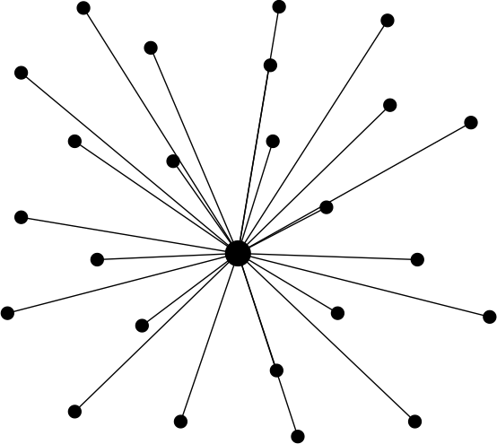
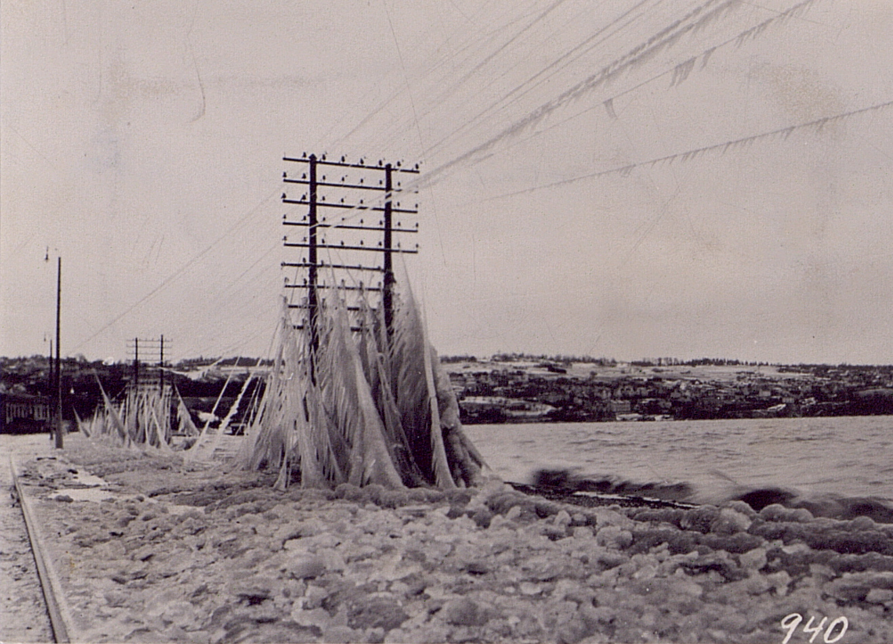
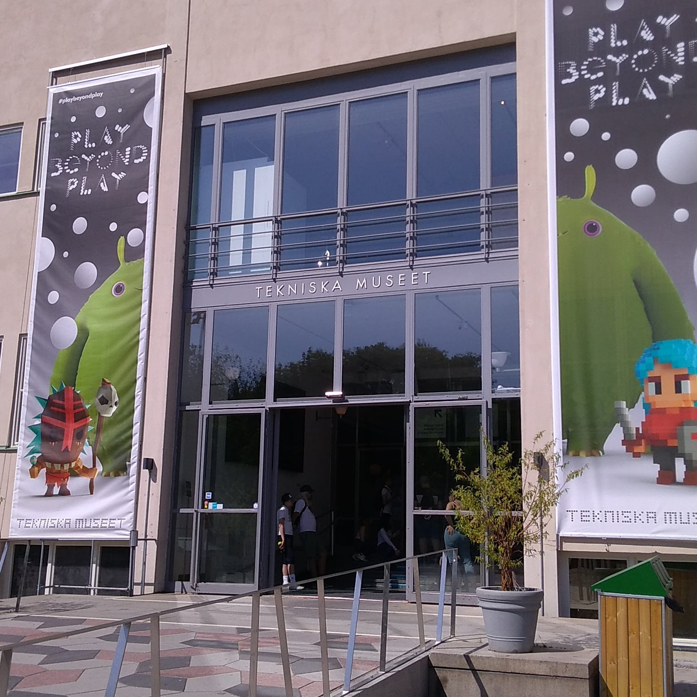
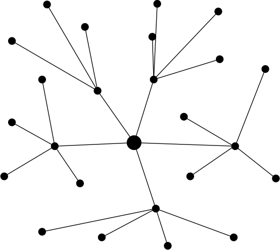
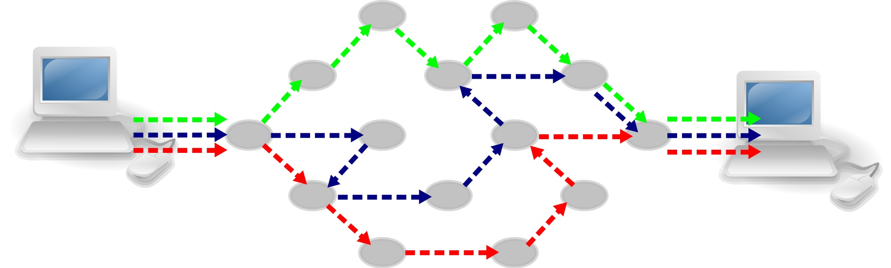

theme: Plain Jane, 2
footer: Kenji Rikitake / oueees 201906 part 1 11-JUN-2019
slidenumbers: true
autoscale: true


# oueees-201906 talks Part 1/3: Packet Switching

<!-- Use Deckset 2.0, 4:3 aspect ratio -->

---

# Kenji Rikitake

11-JUN-2019
School of Engineering Science
Osaka University
Toyonaka, Osaka, Japan
@jj1bdx

Copyright ©2018-2019 Kenji Rikitake.
This work is licensed under a [Creative Commons Attribution 4.0 International License](https://creativecommons.org/licenses/by/4.0/).

---

# Lecture notes

* <https://github.com/jj1bdx/oueees-201906-public/>
* Check out the README.md file and the issues!

---

# Reporting

* Keyword at the end of the talk
* URL for submitting the report at the end of the talk

---

# Preamble: the risk of being a professional and exposure to the public

* You might be harassed, harmed, and attacked at any time
* The attackers are *anonymous* while you are *well-identified*
* *Anyone can be a target*
* Stay low profile when you can
* Stay vigilant

---

# Today's topic: communication fundamentals of the packet switching networks

---

# Communication: sharing a medium

* Sharing a physical link between two or multiple parties
* *The physical layer*
* A medium could be: electric wires, optic fibers, radio airwaves, sound, flying birds like pigeons

---


# Connecting unconnected nodes

There are many ways to connect the dots in this picture

---



# Simplest way: star/centralized connection

- Centralized connection was the easiest way to connect the nodes
- Very much susceptible to network link failures
- Links should stay connected during the connection

---


# The old Stockholm telephone tower in 1890

` `

---



# Fallen telephone lines by frost at Jönköping, Sweden, 1929

` `

---



# Tekniska museet in Stockholm 
## (June 2018)

` `

---

# Multiplexing: sharing the same link by multiple nodes and communication devices

---



# Multiplexing enables decentralization

- Some links carry shared traffics for many different nodes

---

# How to multiplex different types of information, and put them together for sharing a same medium?

---

# Signal characteristics used for multiplexing

* Space division (multiple lines or multiple beam-formed antennas)
* Time division
* Frequency/wavelength division
* Polarization division
* Code division (multiple codes of very small cross-correlation)

---

# Packet switching

What if you can split a stream into the *packets* and let them be delivered through *different links* for each packet?

---

# How to form a packet (1/2)

* Split a stream into multiple pieces of data

```
ABCDEFHIJ -> ABC DEF HIJ
```

* Put a header on each piece

```
ABC DEF HIJ -> P1-ABC P2-DEF P3-HIJ
```

---

# How to form a packet (2/2)

* Add source and destination addresses to each packet

```
P1-ABC P2-DEF P3-HIJ
 ->  FromXtoY-P1-ABC
     FromXtoY-P2-DEF
     FromXtoY-P3-HIJ
```

* Then send them on the network!

---

<!-- animated gif -->
[.background-color: #FFFFFF]


---

# Packet switching and the nodes

* Each communication node must know how to assemble/disassemble information to/from the packets
* Each communication node must know which link should be used to send a packet for the given destination
* Packets can be lost; relaying nodes cannot detect a lost packet

---

# Packet (dis)assembly issues

* The sequence of delivered packets may differ from that of the sender intents; holding the out-of-sequence packets are required
* Retransmission is required to recover a lost packet for a reliable communication

---

[.background-color: #FFFFFF]


---

# Packet switching enables

* Changing the packet relay routes *during* the communication
* Using multiple routes for a single communication link
* Aggregating multiple communication links into a physical link
* Connectionless *and* connection-oriented communication simultaneously

---


# Truly distributed networks are feasible by packet switching

* No centralized nodes
* Each link can be utilized by all nodes
* A disconnection of the link will not be fatal so long as one link is connected to a node

---

# Disadvantages of packet switching

* Each node must be able to form/generate and decode/interpret a packet
* Forming and decoding a packet takes time and the computing resources
* Reliability and latency can be a trade-off
* Relay nodes can be neutralized by denial-of-service attacks
* Difficult to manage

---

# Topics on next talk

* IP addresses
* Routing and the information dissemination
* Transport protocols (TCP, UDP, HTTP(/2), QUIC)

---

# Photo credits

* All photos are modified and edited by Kenji Rikitake
* Photos are from Unsplash.com unless otherwise noted

* Title: [Shane Rounce](https://unsplash.com/photos/1ZZ96uESRJQ)
* Stockholm telephone tower: [Tekniska museet](https://www.flickr.com/photos/tekniskamuseet/6838150900/in/album-72157629589461917/), from Flickr, CC BY 2.0
* Jönköping telephone lines: [Tekniska museet](https://www.flickr.com/photos/tekniskamuseet/6978810049/in/album-72157629575713829/), from Flickr, CC BY 2.0
* Tekniska museet photo: Kenji Rikitake, CC BY 4.0
* Packet Switching animated GIF: [By Oddbodz from Wikimedia Commons](https://upload.wikimedia.org/wikipedia/commons/f/f6/Packet_Switching.gif), CC BY-SA 3.0
* Internet packet switching: [By Computer-blue.svg: OpenClipartderivative work: Pluke (Computer-blue.svg)](https://upload.wikimedia.org/wikipedia/commons/c/c0/CPT-internet-packetswitching.svg), via Wikimedia Commons, CC0 (Public Domain)

<!--
Local Variables:
mode: markdown
coding: utf-8
End:
-->
