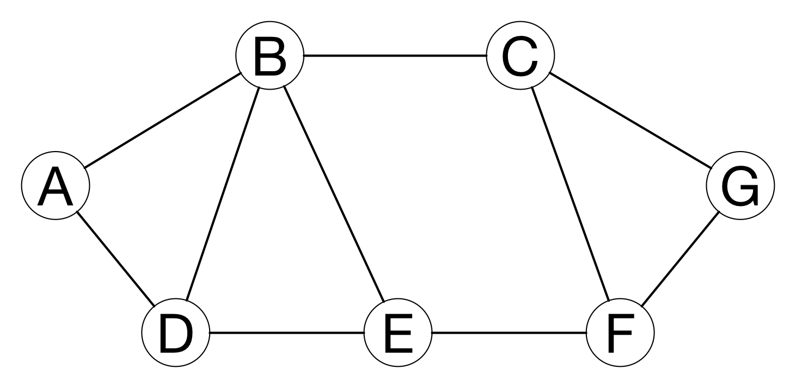
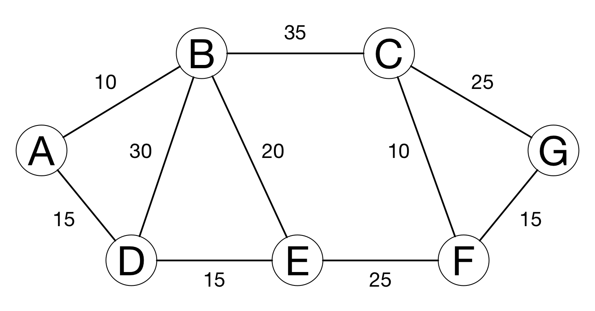
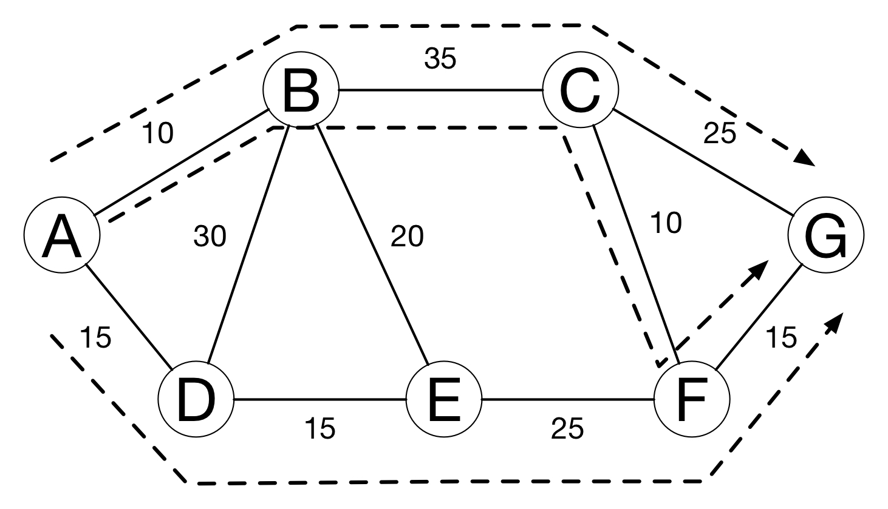
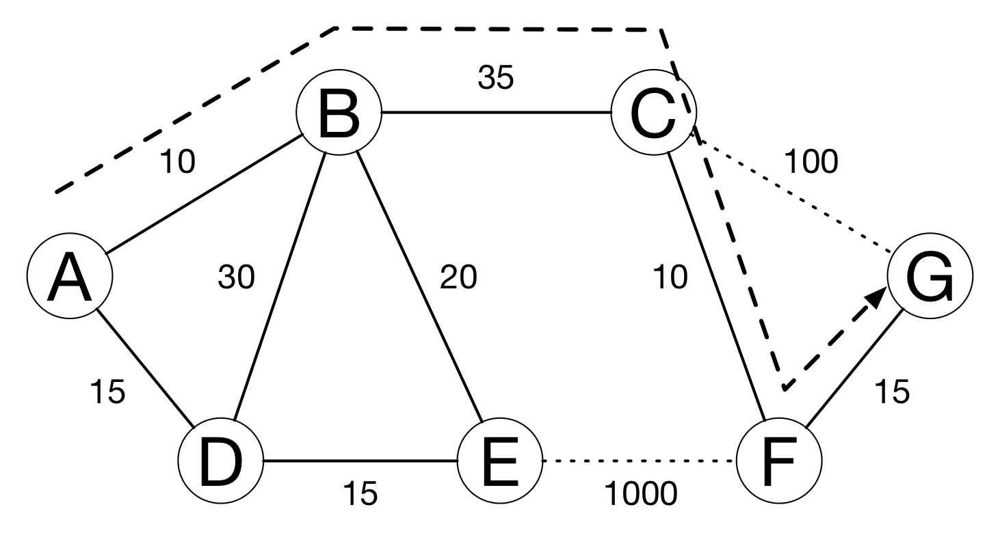

theme: Plain Jane, 2
footer: Kenji Rikitake / oueees 201906 part 2 18-JUN-2019
slidenumbers: true
autoscale: true

# oueees-201906 talks Part 2/3:Routing and transport protocols

<!-- Use Deckset 2.0, 4:3 aspect ratio -->

---

# Kenji Rikitake

18-JUN-2019
School of Engineering Science
Osaka University
Toyonaka, Osaka, Japan
@jj1bdx

Copyright ©2018-2019 Kenji Rikitake.
This work is licensed under a [Creative Commons Attribution 4.0 International License](https://creativecommons.org/licenses/by/4.0/).

---

# Lecture notes

* <https://github.com/jj1bdx/oueees-201906-public/>
* Check out the README.md file and the issues!

---

# Reporting

* Keyword at the end of the talk
* URL for submitting the report at the end of the talk

---

# Today's topic: flexible packet routing and transport protocols

---

# Various aspects of routing

* Delivery
* Addresses
* Static or dynamic
* Route aggregation
* Security

---

# Delivery schemes

* Unicast
* Broadcast/Multicast/Anycast

---
[.background-color: #FFFFFF]

---
[.background-color: #FFFFFF]

---

# Internet protocol (IP) and IP addresses

---

# Role of IP addresses

* Network numbers
* Interfaces: connected to the networks
* Host IDs in the numbered networks
* Global uniqueness
* Special addresses (private, broadcast, multicast, loopback, etc.)

---

# [fit] IPv4 addresses: 32 bits
# [fit] 192.168.100.20
# [fit] In hexadecimal notation: 0xC0A86414

- 4 x 0~255 numbers split with dots
- Relatively easy to remember, but already being used up

---

# [fit] IPv4 address with netmask
# [fit] 192.168.100.20/24

- Network: 192.168.100.0/24
- Host: number 20 (0~255) (32-24=8)
- Host 0 = network itself
- Host 255 = broadcast

---

# [fit] Address in another netmask
# [fit] 192.168.100.20/28

- Network: 192.168.100.16/28
- Host: number 2 (0~15) (32-24=4)
- Host 0 = network itself
- Host 15 = broadcast
- Different netmask = different address interpretation

---

# Private addresses (RFC1918)
# [fit] No global routing for these address blocks

- 10.0.0.0/8
- 172.16.0.0/12 (172.{16~31}.\*.\*)
- 192.168.0.0/16 (192.168.\*.\*)

---

# Other special addresses (RFC6890)

- 0.0.0.0/8: "This" network
- 100.64.0.0/10: Shared address
- 127.0.0.0/8: Loopback
- 169.254.0.0/16: Link local
- 192.0.0.0/24: IANA specific
- 192.0.2.0/24, 198.51.100.0/24, 203.0.113.0/24: Documentation
- 192.88.99.0/24: 6to4 Relay Anycast
- 198.18.0.0/15: Benchmarking
- 240.0.0.0/4: Reserved
- 255.255.255.255/32: Limited broadcast

---

# [fit] IPv6 addresses: 128 bits
# [fit] 2404:6800:400a:808::2004
# [fit] = 2404:6800:400a:0808:0000:0000:0000:2004

* www.google.com as of 17-JUN-2019 0505UTC
* :xxxx: = up to 4 hex digits
* :: = arbitrary number of 0, appearing only once in an address

---

# [fit] IPv6 addresses with netmask
# [fit] 2404:6800:400a:808::2004/64

* Network: 2404:6800:400a:808::/64
* Host number: 0x0000000000002004
* Host number: 64 bits (0: network)
* Broadcast -> multicast addresses
* ff02::1 = all hosts, ff02::2 = all routers, etc.

---

# Why IPv4 to IPv6?

- Because we've used up the 32-bit IPv4 addresses already
- No more new address block for IPv4
- You need to buy unused blocks from other users
- Took ~20 years (1996-2016) for the transition from IPv4 to IPv6

---

# Routing

---
[.background-color: #FFFFFF]

---

# Static routing

- Set the default route for nodes which are not directly reachable
- Works well on simple networks or star networks
- Static routing may cause *ping-pong*

---
[.background-color: #FFFFFF]

---
[.background-color: #FFFFFF]

---

# Dynamic routing

- Hop count: count the hops between nodes
- Link cost: determined by the speed and quality
- Administrative policies

---

# Simple hop counting

- Assume every link costs the same with each other

---

[.background-color: #FFFFFF]

---

# Evaluating link cost

- What if the cost of each link varies?
- If two or more paths have the equal cost, all of the links will be utilized for load balancing

---
[.background-color: #FFFFFF]

---
[.background-color: #FFFFFF]

---

# Simulating link failures

- What if the link suddenly degrades or is disconnected?
- Largely increasing the cost of degraded or disconnected links will give an easy solution

---
[.background-color: #FFFFFF]

---

# Administrative policies

* For many reasons, you don't want to accept packets from some nodes, depending on the relay paths
* For example: passing C is OK, but passing E is not: A-B-C-G and A-B-C-F-G are OK, but A-D-E-F-G is blocked
* Common among interconnection of the autonomous systems (internet service providers and organizations)

---
[.background-color: #FFFFFF]

---

# Routing information dissemination protocols

* Link-state protocol: flooding link cost information of each node throughout the network
* Path vector protocol: exchanging path of nodes for each network instead of the link costs
* Highly vulnerable to external attacks

---

# Routing aggregation

- The following four networks
  * 192.168.100.0/24
  * 192.168.101.0/24
  * 192.168.102.0/24
  * 192.168.103.0/24
- -> aggregated as 192.168.100.0/22
- 4 networks together as one aggregated network

---

# Network transports

---

# IP address and the port number

* Each service has a 16-bit port number
* HTTPS = 443, DNS = 53, SSH = 22, etc.
* A pair of IP address and port number defines an endpoint of communication

---

# UDP and TCP

* Two major transport protocols on the internet
* User Datagram Protocol (UDP): connection-less
* Transport Control Protocol (TCP): connection-oriented

---

# Packet exchange limitation

* Packets are not always delivered
* Sending sequence is not preserved
* The same packet may be received multiple times
* The content of the packet may get altered or damaged
* Packet size has the limitation

---

# What UDP does

* Add a header with the port number
* Send it in an IP packet
* ... and that's it

---

# UDP's pros and cons

* UDP datagrams are still not always delivered and may get lost
* Sequence is not preserved
* The same datagram may be received multiple times and may cause duplicate delivery
* The errors in the contents of UDP datagrams are detectable
* UDP datagram has the size limit: suitable for relatively small messages
* Very small additional latency

---

# Transport control protocol (TCP)

* Detect packet loss by timeout
* Split stream into segments
* Put sequence numbers to the segments
* Reassemble segments to the stream
* Perform congestion control

---

# TCP's pros and cons

* Loss is detected and recovered so long as the connection is alive
* Sequence is preserved
* No content repetition
* Errors are detected and fixed by retransmission
* The stream will accept data so long as the connection is alive
* Data delivery may delay if retransmission occurs

---

# Web: HTTP/2 (TCP) .vs. QUIC (UDP)

* People wants *speed*
* HTTP/2: stream aggregation and content compression
* HTTP/2 is still bound by TCP
* QUIC: tightly integrated to HTTP/2 and specific congestion control
* Google is migrating to HTTP/2 + QUIC

---

# Topics on next talk

* Cloud computing .vs. endpoint computing
* Sharing .vs. message passing
* Centralization .vs. decentralization

---

# Photo credits

* All photos are modified and edited by Kenji Rikitake
* Title: [Denis Nevozhai](https://unsplash.com/photos/_QoAuZGAoPY) via Unsplash
* Unicast/broadcast/multicast/anycast diagrams: [By Easyas12c~commonswiki / Perhelion](https://en.wikipedia.org/wiki/Routing#/media/File:Cast.svg), via Wikimedia Commons, CC0 (Public Domain)

<!--
Local Variables:
mode: markdown
coding: utf-8
End:
-->
