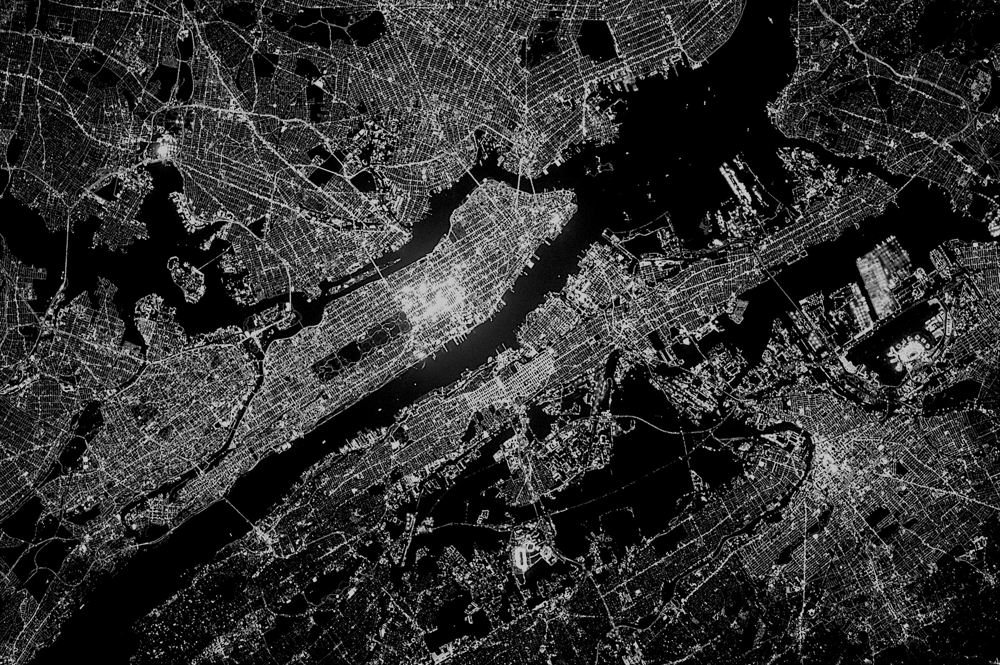
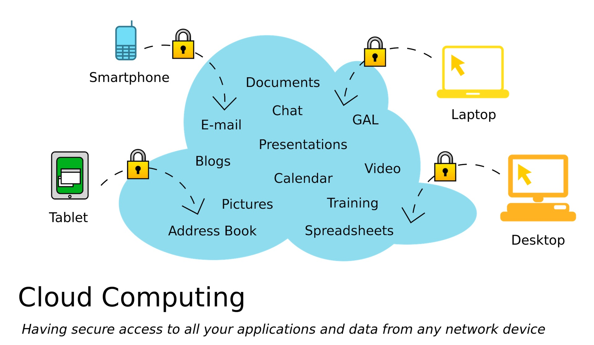
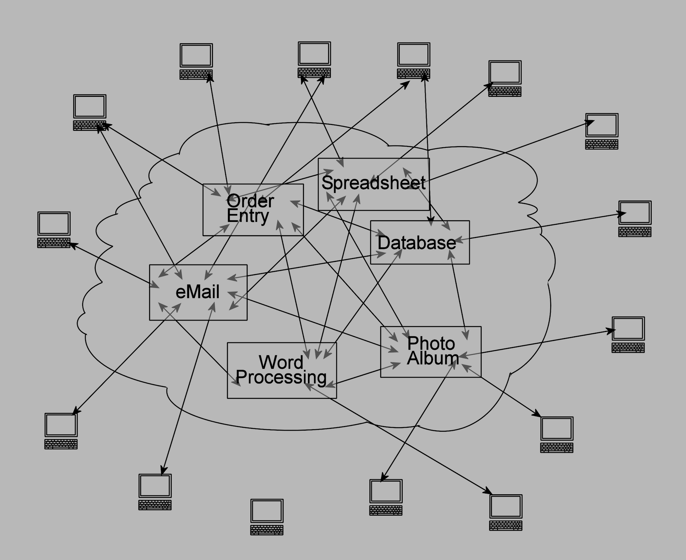
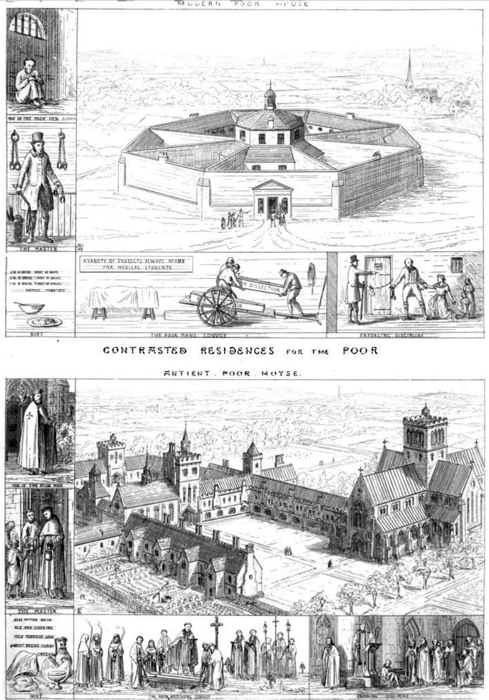
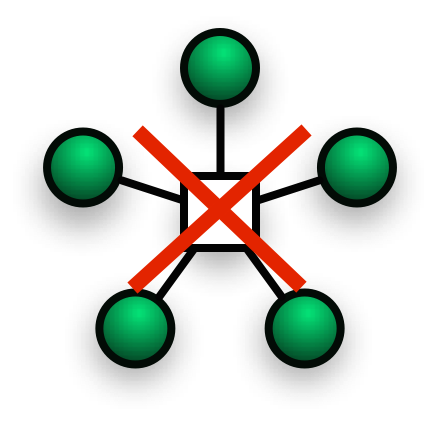
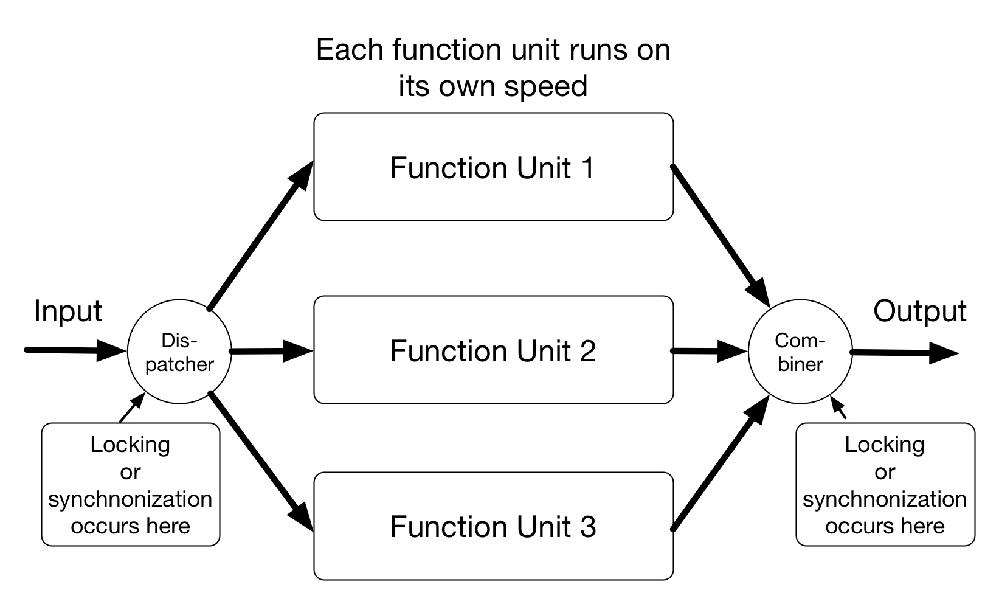
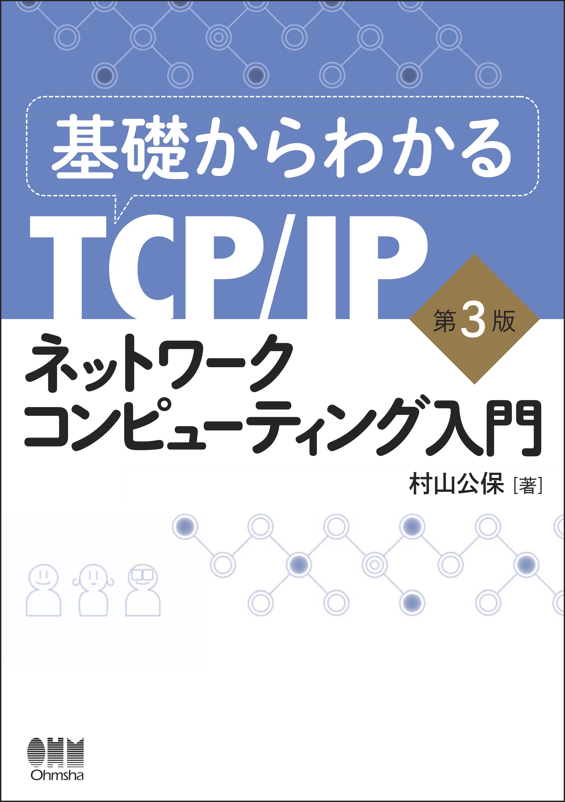
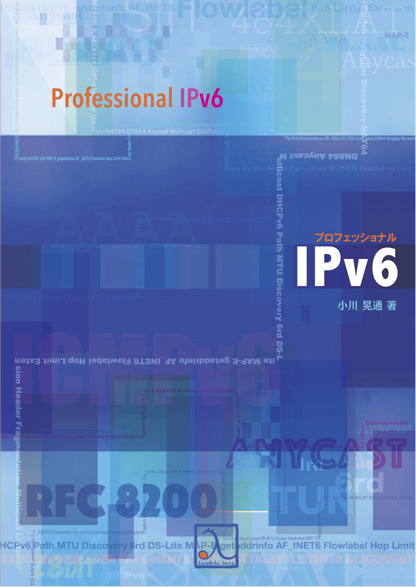

theme: Plain Jane, 2
footer: Kenji Rikitake / oueees 201906 part 3 25-JUN-2019
slidenumbers: true
autoscale: true

# oueees-201906 talks Part 3/3: Centralized and distributed systems

<!-- Use Deckset 2.0, 4:3 aspect ratio -->

---

# Kenji Rikitake

25-JUN-2019
School of Engineering Science
Osaka University
Toyonaka, Osaka, Japan
@jj1bdx

Copyright ©2018-2019 Kenji Rikitake.
This work is licensed under a [Creative Commons Attribution 4.0 International License](https://creativecommons.org/licenses/by/4.0/).

---

# Lecture notes

* <https://github.com/jj1bdx/oueees-201906-public/>
* Check out the README.md file and the issues!

---

# Reporting

* Keyword at the end of the talk
* URL for submitting the report at the end of the talk

---

# Today's topic: centralized and distributed systems

---

# Modern computing *is cloud computing*

---
[.background-color: #ffffff]

---

# Is cloud really a uniform and single entity?

---

# Absolutely not: it's an intertwined *network* of computers

---

# Web services are clusters of computers and networks

Thousands or millions of servers connected together

A physical server is separated into multiple virtual machines

---

# Cloud computing *is* centralization

---

# An example of cloud computing: Internet of Things (IoT) and telemetering

---

[.background-color: #ffffff]

---

# Telemetering

* Mostly unidirectional (not really *the true and genuine internet*)
* Sensors/devices gathering data through internet and feed them to the servers in the cloud computing platforms
* *The servers compute*
* *Extremely centralized*

---

# The social implication of cloud computing

---

## Centralized social behavior accerelated by cloud computing

* Sharing *everything* - no privacy
* *Panopticon* [^1] style of governance, filtering, *censorship, or autocracy*
* Complete *externalization* of resources, leading to *no personal control*

[^1]: n. a circular prison with cells arranged around a central well, from which prisoners could at all times be observed. (New Oxford American Dictionary, Apple macOS 10.13.6)

---

# Presidio Modelo: a panopticon prison

---

[.background-color: #ffffff]

---

# INGSOC: the slogans [^2]

* War is peace
* Freedom is slavery
* Ignorance is strength

* Independent thinking = *thoughtcrime*

## NOTE: this is a *fiction*!

[^2]: George Orwell, "Nineteen Eighty-Four", 1949.

---

# Why cloud computing has become so *dystopian*? -- because we have sold freedom for *convenience*

* Ubiquitous/global accessibility
* Concentrated data for easy analysis
* Easy control of the information flow
* No extra cost for sharing
* No need to think about where the information locates

---

# The inconvenient truth of centralized systems: what if the core/cloud fails?

---

## Inconvenience of centralized systems

* Ubiquity or *no accessibility*
* When the core fails, no alternative
* When the core loses data, *no backup*
* The system performance is restricted by the capability of the core
* Endpoint systems will lost *all capabilities*

---

# Centralized systems are *not* sustainable

- ...then how cloud computing systems manages the sustainability?

---

# Distributed systems provide sustainability and resilience against failures

---

# Networks

---

[.background-color: #ffffff]

---

# Networks *split*

---
[.background-color: #ffffff]

---

# Partition/fault tolerance: distributed systems should not stop working even if netsplit occurs

---

# Real-world challenges

* Natural disasters
* Device failures
* Human operation errors
* Political impediments
* Social resentments

---

# Handling *failures*

* Redundancy: keeping backup units ready
* Fault tolerance: keeping systems running even the components fail
* Resilience by failing fast: early detection of failures and invocation of the recovery procedures

---

# Why fault tolerance?

* Hard disk MTBF ~= 1 million hours
* 1000 hard disks running 24 hours x 365 days = 8.76 million  hours
* If you're running a system with 1000 hard disks, **9 out of 1000** will fail in a year
* Recovery of a disk content takes often *a day*; you can't stop a system for *a day*, can you?

---

# Requirement to keep the systems fault tolerant

* Redundancy: two or more resources for each unit of processing
* Supervising the failure of the units by an independent supervisor
* Rollback capability: undo the incomplete operations and retry

---

# Consistency issues of distributed systems

* Locking/synchronization: waiting all data to be ready to compute or proceed to next step
* Choosing the *right* data: which data is *correct*?
* Supervision: fault detection and restarting

---
[.background-color: #ffffff]

---
[.background-color: #ffffff]

---

# Eight Fallacies of Distributed Computing[^3] (1/2)

* **The network is reliable**
* **Latency is zero**
* **Bandwidth is infinite**
* The network is secure

[^3]: <https://blog.fogcreek.com/eight-fallacies-of-distributed-computing-tech-talk/>

---

# Eight Fallacies of Distributed Computing (2/2)

* Topology doesn't change
* There is one administrator
* Transport cost is zero
* The network is homogeneous

---

# Summary: centralized computing is fragile; distributed computing is fault tolerant but hard

---

# Appendix 1: references for further study

---

# 基礎からわかるTCP/IPネットワークコンピューティング入門 第3版

- オーム社 ISBN 9784274050732
- [達人出版会の電子書籍](https://tatsu-zine.com/books/kiso-tcpip-nwcp3)

---

# プロフェッショナルIPv6

- [ラムダノートの紙の本+電子書籍](https://www.lambdanote.com/products/ipv6)
- [Boothの無料版](https://professionalipv6.booth.pm/items/913273)

---

# Appendix 2: on choosing your career and professionality

---

# When I chose my career and professionality?

* Age 9: computers and English
* Age 10 ham radio and electronics
* Age 14: writing commercial software
* *Age 23: finally decided to make my living on my computer software professionality, with my English proficiency*

---

# If I were at age 22, what I would do after getting a Bachelor's degree?

* Get out of Japan ASAP
* Explore the computer skills
* Do something unpopular

# [fit] Go abroad

---

# What are the most important things to pursue engineering/scientist career?

* Physical strength
* Mental strength
* Curiosity

# [fit] Curiosity matters

---

# Photo credits

* All photos are modified and edited by Kenji Rikitake
* Photos are from Unsplash.com unless otherwise noted

* Title: NASA
* Modern Computing is Cloud Computing: Rayi Christian Wicaksono
* Cloud Computing: <https://commons.wikimedia.org/wiki/File:Cloud_applications_SVG.svg>, licensed under [Creative Commons CC0 1.0 Universal Public Domain Dedication](https://creativecommons.org/publicdomain/zero/1.0/deed.en)
* Intertwined network of computers: <https://en.wikipedia.org/wiki/File:Cloud_Computing.jpg>, licensed under [Creative Commons CC0 1.0 Universal Public Domain Dedication](https://creativecommons.org/publicdomain/zero/1.0/deed.en)
* Web services are clusters of computers: Kenji Rikitake, at Kyoto University ACCMS, April 2017
* Presidio Modelo Prison: By Friman [Public domain], from [Wikimedia Commons](https://commons.wikimedia.org/wiki/File:Presidio_Modelo.JPG)
* Panopticon: Jeremy Bentham, Public domain, via [Wikimedia Commons](https://commons.wikimedia.org/wiki/File:Panopticon.jpg)
* Contrasted Residences for The Poor: By Augustus Pugin [Public domain], via [Wikimedia Commons](https://commons.wikimedia.org/wiki/File:Contrasted_Residences_for_the_Poor.jpg)
* Networks: Irina Blok
* Networks Split: Pietro De Grandi
* Netsplit: <https://commons.wikimedia.org/wiki/File:Netsplit_split.svg>, in public domain

<!--
Local Variables:
mode: markdown
coding: utf-8
End:
-->
